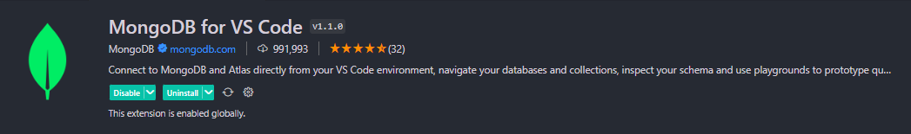

# Mongo DB

Se realizo una proyecto en el que creamos una base de datos en mongo db y se realizaron algunas consultas para la practica.

## USO DEL TRABAJO

Recuerda que debes tener instalada la extensión de "MongoDB for VS code"

## Installation

1. **Clona este repositorio en tu computadora, usa el siguiente comando:**

- `git clone https://github.com/Jean0405/mongoBodegas.git`

2. **Asegurate de tener Node.js instalado en tu computadora. De no ser así, descargalo e instala [Node js](https://nodejs.org/es/download)**

3. **Instala las dependecias necesarias de forma automatica con el siguiente comando, el cual tomara el archivo _package.json_ y lo tomara de guía para dichas instalaciones.**

- `npm install`

4. **ejecuta el archivo db/atlas.mongodb**

5. **ejecuta**

- `npm run dev`

### [BASE DE DATOS]

Al clonar, podrás ejecutar del archivo **db/atlas.mongodb** para crear, relacionar e insertar los datos para pruebas de ejemplo.

Ejemplo de las colecciones creadas para la práctica.

1. **sucursal:**
2. **automovil:**
3. **sucursal_automovil:**
4. **cliente:**
5. **alquiler:**
6. **reserva:**
7. **empleado:**
8. **registro_entrega:**
9. **registro_devolucion:**

## GENERAR TOKEN DE CADA COLECCIÓN

🔴🔴🔴 **GET/POST/PUT/DELETE** `http://127.25.25.25:3300/token/:collection`

### CONSULTAS DEL TALLER

🟢 _Listar todos los clientes registrados en la base de datos._

**GET** `http://127.25.25.25:3300/cliente`

🟢 _Obtener todos los automóviles disponibles para alquiler._

**GET** `http://127.25.25.25:3300/automovil`

🟢 _Listar todos los alquileres activos junto con los datos de los clientes relacionados._

**GET** `http://127.25.25.25:3300/alquiler`

🟢 _Mostrar todas las reservas pendientes con los datos del cliente y el automóvil reservado._

**GET** `http://127.25.25.25:3300/reserva/pendientes`

🟢 _Obtener los detalles del alquiler con un ID_Alquiler específico_

**GET** `http://127.25.25.25:3300/alquiler/:id`

🟢 _Listar los empleados con el cargo de "Vendedor"._

**GET** `http://127.25.25.25:3300/empleado/vendedor`

🟢 _Mostrar la cantidad total de automóviles disponibles en cada sucursal junto con su dirección._

**GET** `http://127.25.25.25:3300/sucursal/disponibles`

🟢 _Obtener el costo total de un alquiler específico._

**GET** `http://127.25.25.25:3300/alquiler/costo_total/:id`

🟢 _Listar los clientes con el DNI específico._

**GET** `http://127.25.25.25:3300/cliente/:dni`

🟢 _Mostrar todos los automóviles con una capacidad mayor a 5 personas._

**GET** `http://127.25.25.25:3300/automovil/capacidad=5`

🟢 _Obtener los detalles del alquiler que tiene fecha de inicio en '2023-07-05'._

🟢 _Listar las reservas pendientes realizadas por un cliente específico._

**GET** `http://127.25.25.25:3300/reserva/pendientes/:DNI`

🟢 _Mostrar los empleados con cargo de "Gerente" o "Asistente"._

**GET** `http://127.25.25.25:3300/empleado/cargos/GERENTE/ASISTENTE`

🟢 _Obtener los datos de los clientes que realizaron al menos un alquiler._

**GET** `http://127.25.25.25:3300/cliente/alquiler_solicitado/mayor=1`

🟢 _Listar todos los automóviles ordenados por marca y modelo._

**GET** `http://127.25.25.25:3300/automovil/sort`

🟢 _Mostrar la cantidad total de automóviles en cada sucursal junto con su dirección._

**GET** `http://127.25.25.25:3300/sucursal/disponibles`

🟢 _Obtener la cantidad total de alquileres registrados en la base de datos._

**GET** `http://127.25.25.25:3300/alquiler/cantidad_alquileres`

🟢 _Mostrar los automóviles con capacidad igual a 5 personas y que estén disponibles._

**GET** `http://127.25.25.25:3300/automovil/capacidad=5`

🟢 _Listar los alquileres con fecha de inicio entre '2023-07-05' y '2023-07-10'._

**GET** `http://127.25.25.25:3300/alquiler/fecha_inicio_rango`

# AUTOR

[Jean0405](https://github.com/Jean0405)
